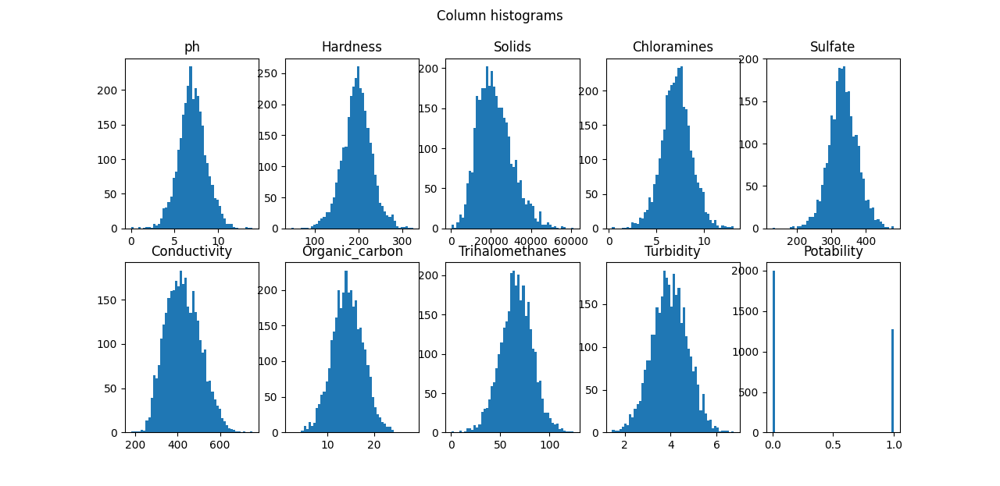
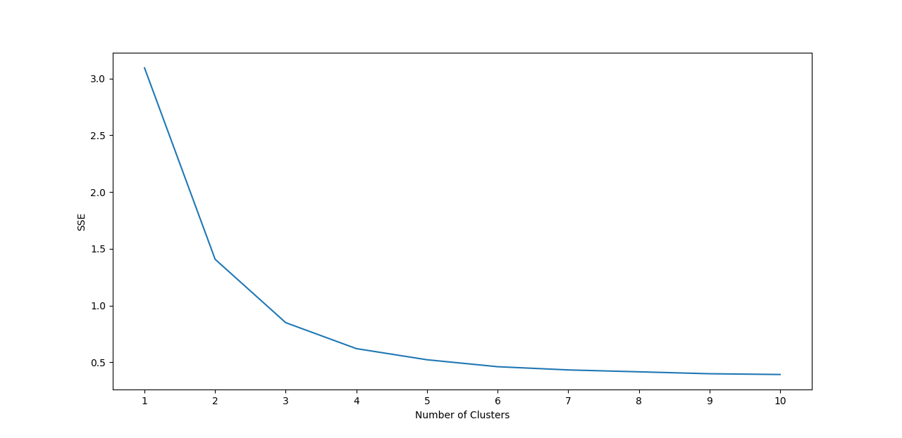
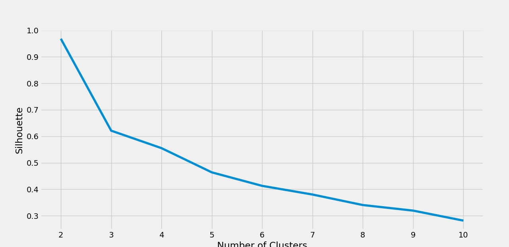
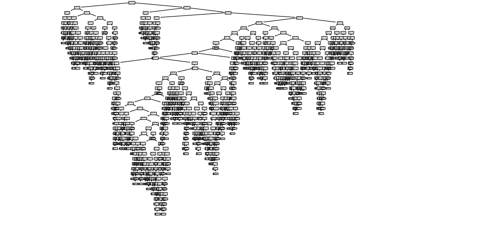
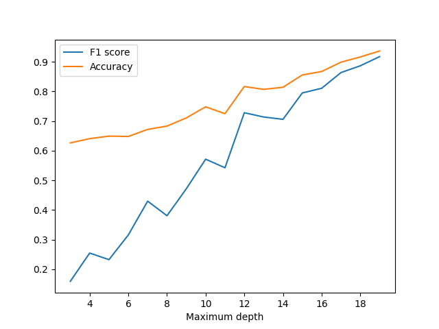

# ITI8565-ML-FinalProject
>Final project for the Machine Learning (ITI8565) course at TalTech

## Index
- [Introduction](#intro)
- [Usage](#usage)
- [Reuirements](#requirements)
- [About the data set](#dataset)
- [Workflow](#workflow)
     - [NaN values](#nan)
     - [Feature selection](#pca)
     - [Clustering](#clustering)
     - [Decision tree classifier](#tree)
- [Code structure](#code)
- [References](#references)

<a name="intro"></a>

## Introduction
All the code is written in python. 

*Explain necessity to use Machine Learning.*
*Proposed solution should include at least three different Machine Learning techniques, whereas one should belong to the area of unsupervised learning and one to the area of supervised learning.*

<a name="usage"></a>


## Usage
There is a main file that executes all the analysis:
```bash
python main.py
```
More on the different modules in: [Code structure](#code)

<a name="requirements"></a>
## Reuirements
This are the different libraries that have been used:
From the standard pytohon libraries:
```
multiprocessing
copy
```
Libraries that need to be installed using ```pip install [library_name]```:
```
matplotlib
pandas
sklearn
seaborn
```

<a name="dataset"></a>

## About the data set
The file containing the data can be downloaded from the Kaggle web site [water potability](https://www.kaggle.com/adityakadiwal/water-potability).
It is a csv file containing data about different parameters of the water:
1. *ph*: pH of 1. water (0 to 14).
2. *Hardness*: Capacity of water to precipitate soap in mg/L.
3. *Solids*: Total dissolved solids in ppm.
4. *Chloramine*: Amount of Chloramines in ppm.
5. *Sulfate*: Amount of Sulfates dissolved in mg/L.
6. *Conductivity*: Electrical conductivity of water in μS/cm.
7. *Organic_carbon*: Amount of organic carbon in ppm.
8. *Trihalomethanes*: Amount of Trihalomethanes in μg/L.
9. *Turbidity*: Measure of light emiting property of water in NTU.
10. *Potability*: Indicates if water is safe for human consumption. Potable -1 and Not potable -0

Seeing the histograms of each feature  (figure 1) we can see they are normally distributed


*Figure 1. Data features histograms*

Also if we calculate the correlation matrix there is no significant correlation between any of the features as can be see in figure 2:

*Figure 2. Correlations plot*

<a name="workflow"></a>

## Workflow

<a name="nan"></a>

### NaN values

NaN value per feature:
| Feature | NaN values|
|---|---|
|ph                  |   491|
|Hardness            |   0  |
|Solids              |   0  |
|Chloramines         |   0  |
|Sulfate             |   781|
|Conductivity        |   0  |
|Organic_carbon      |   0  |
|Trihalomethanes     |   162|
|Turbidity           |   0  |

The different NaN values have being filled with the mean of the feature. Other alternatuve would be to interpolate the values but since the is no relation between the features there are no 2 variables to interpolate. Another option would be to eliminate the rows with NaN values but that means getting rid of 491+781+162=1434 values (43%). 
<a name="pca"></a>

### Feature selection


<a name="clustering"></a>

### Clustering

Clustering has been performed using k-means.


*Figure 3. Clustering number decision based on knee method (SSE)*

While the knee method gives us cluster number of *k=3* but with the silhouette coefficient calculation is perfectly clear that is still 2. This clustering just confirms the data is good enough to be classified in 2 classes and not more. 


*Figure 4. Clustering number decision based on silhouette coefficients*

<a name="tree"></a>

### Decision tree classifier


*Figure 5. Full tree classifier with 100% accuracy and F1 score*


*Figure 6. Tree classifier performance depending on the maximum depth allowed*

<a name="code"></a>
## Code structure
The code is divide in several scripts that are not meant to be run independently. They contain functions and they are used in the ```main.py``` like a pipeline.

- [main.py](main.py)
     - [data_loading.py](data_loading.py)
     - [plot_initial_data.py](plot_initial_data.py)
     - [data_analysis.py](data_analysis.py)
     - [normalization.py](normalization.py)
     - [feature_selection.py](feature_selection.py)
     - [clustering.py](clustering.py)
     - [decision_tree.py](decision_tree.py)

Helper function used in several scripts:
- [plotting.py](plotting.py)


<a name="references"></a>

## References
- [scikit-learn documentation](https://scikit-learn.org)
- [Feature Selection For Machine Learning in Python](https://machinelearningmastery.com/feature-selection-machine-learning-python/)
- [K-Means Clustering in Python: A Practical Guide](https://realpython.com/k-means-clustering-python/#how-to-perform-k-means-clustering-in-python)
