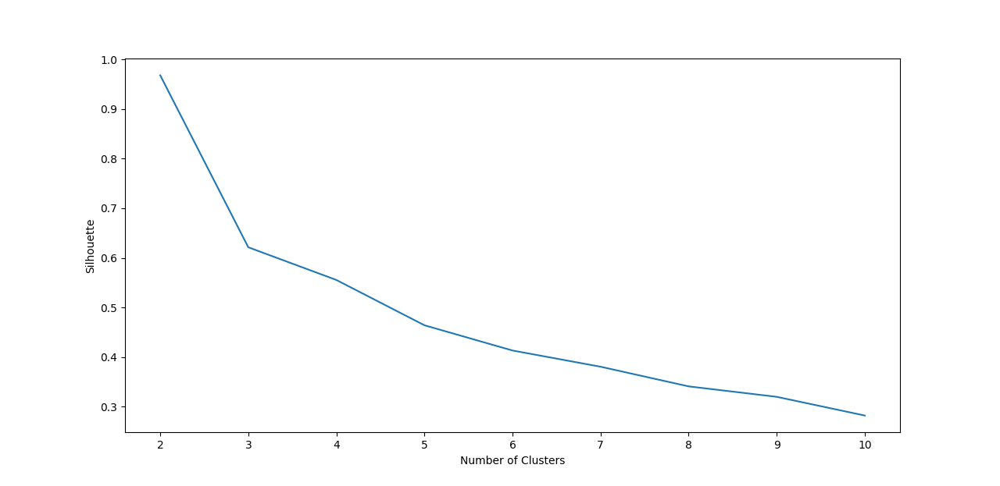
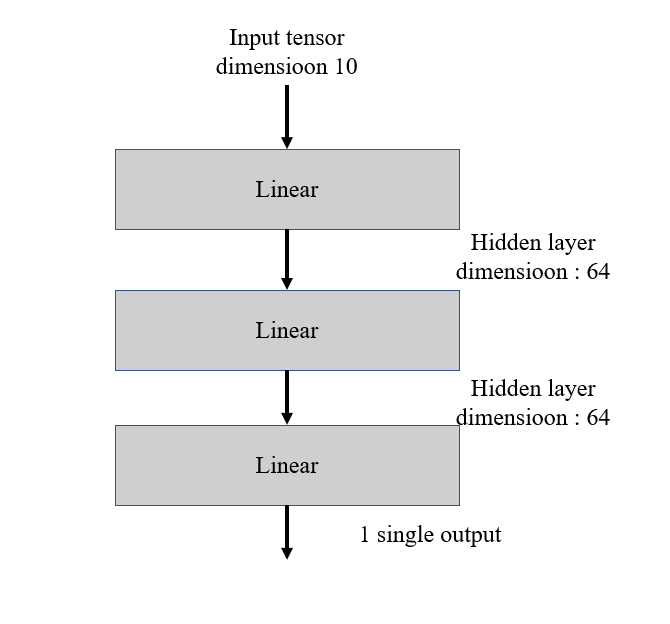

# ITI8565-ML-FinalProject
>Final project for the Machine Learning (ITI8565) course at TalTech

## Index
- [Introduction](#intro)
- [Usage](#usage)
- [Reuirements](#requirements)
- [About the data set](#dataset)
- [Workflow](#workflow)
     - [NaN values](#nan)
     - [Feature selection](#pca)
     - [Clustering](#clustering)
     - [Decision tree classifier](#tree)
     - [Neural Network binary classifier](#nn)
- [Conclusions](#conclusions)
- [Code structure](#code)
- [References](#references)

<a name="intro"></a>

## Introduction

Water potability is a very important quality of the water, essential for human being. Sometimes is not so easy to say if it is safe to drink it or not. There are many parameters that influence its potability as described in the data set section of this paper.

The goal of this project is to find a model that can predict accurately if the water is potable or not. Part of the goal is to discover what are the parameters of the water that contribute most to the potability of the water and explore if there is an efficient way of safely say the water is potable with the minimum number of parameters. Such investigation requires inquire into different machine learning methods that can help find such an answer better than simple linear regressions and probability studies.

<a name="usage"></a>


## Usage
There is a main file that executes all the analysis:
```bash
python main.py
```
There is an argument that can be given in the CLI for make in it into presentation mode that helps going step by step but requires some inputs too:
```bash
python main.py -presentation
```
More on the different modules in: [Code structure](#code)

<a name="requirements"></a>
## Reuirements
This are the different libraries that have been used:
From the standard python libraries:
```
multiprocessing
copy
sys
```
Libraries that need to be installed using ```pip install [library_name]```:
```
matplotlib
pandas
sklearn
seaborn
pandas
numpy
kneed
torch
```
For installing ```torch``` using pip:
```bash 
pip3 install torch==1.8.1+cpu torchvision==0.9.1+cpu torchaudio===0.8.1 -f https://download.pytorch.org/whl/torch_stable.html
```
Taken from [https://pytorch.org/get-started/locally/](https://pytorch.org/get-started/locally/)
<a name="dataset"></a>

## About the data set
The file containing the data can be downloaded from the Kaggle web site [water potability](https://www.kaggle.com/adityakadiwal/water-potability).
It is a csv file containing data about different parameters of the water:
1. *ph*: pH of 1. water (0 to 14).
2. *Hardness*: Capacity of water to precipitate soap in mg/L.
3. *Solids*: Total dissolved solids in ppm.
4. *Chloramine*: Amount of Chloramines in ppm.
5. *Sulfate*: Amount of Sulfates dissolved in mg/L.
6. *Conductivity*: Electrical conductivity of water in μS/cm.
7. *Organic_carbon*: Amount of organic carbon in ppm.
8. *Trihalomethanes*: Amount of Trihalomethanes in μg/L.
9. *Turbidity*: Measure of light emiting property of water in NTU.
10. *Potability*: Indicates if water is safe for human consumption. Potable -1 and Not potable -0

Seeing the histograms of each feature  (figure 1) we can see they are normally distributed


*Figure 1. Data features histograms*

Also if we calculate the correlation matrix there is no significant correlation between any of the features as can be see in figure 2:

*Figure 2. Correlations plot*

<a name="workflow"></a>

## Workflow

<a name="nan"></a>

### NaN values

NaN value per feature:
| Feature | NaN values|
|---|---|
|ph                  |   491|
|Hardness            |   0  |
|Solids              |   0  |
|Chloramines         |   0  |
|Sulfate             |   781|
|Conductivity        |   0  |
|Organic_carbon      |   0  |
|Trihalomethanes     |   162|
|Turbidity           |   0  |

The different NaN values have being filled with the mean of the feature. Other alternatuve would be to interpolate the values but since the is no relation between the features there are no 2 variables to interpolate. Another option would be to eliminate the rows with NaN values but that means getting rid of 491+781+162=1434 values (43%). 
<a name="pca"></a>

### Feature selection
To find which are the values that predict that contribute the most to the variance of the data a Principal Component Analysis has been performed. Turns out these are the 3 parameters that contribute the most: ph, hardness, and solids.
These three features alone explain 92.71% + 4.12% + 2.26% = 99.08% of the variance.

<a name="clustering"></a>

### Clustering

Clustering has been performed using k-means.


*Figure 3. Clustering number decision based on knee method (SSE)*

While the knee method gives us cluster number of *k=3* but with the silhouette coefficient calculation is perfectly clear that is still 2. This clustering just confirms the data is good enough to be classified in 2 classes and not more. 


*Figure 4. Clustering number decision based on silhouette coefficients*

<a name="tree"></a>

### Decision tree classifier

Decision tree classifier has been selected for supervised learning. It seemed the right classifier for binary classification.

Since it is a relatively small dataset it can be fit quite extensively so that arriving to high depth it gets a 100% accuracy and F1-score.

In figure 5 can be observed the decision tree until depth 4 and 8 leaves


*Figure 5. Full tree classifier with 100% accuracy and F1 score*

Also, it has been analysed how is the performance growing for the growing maximum depth as it can be seen in figure 6.


*Figure 6. Tree classifier performance depending on the maximum depth allowed*

<a name="nn"></a>

### Neural network binary classifier
As an unsupervised learning method, a neural network has been implemented with the architecture represented in figure 8.


*Figure 7. Neural network architecture*

For the activation function the linear rectifier unit has been used. With the intention of avoiding overfitting a dropout probability has also been added after the hidden layer. Different probabilities have been tested with a very significant change in the output so finally it is set to 0.2.

Figure 8 shows the steady growing the model performance during training and posterior evaluation. But as it can be seen it does not grow over 70% accuracy.


*Figure 8. Performance measured in accuracy of the neural network classifier.*


<a name="conclusions"></a>

## Conclusions

After implemented different methods we have achieved a 100% accuracy in the supervised learning method though it would not be feasible to use it in a larger data set. As well as it seems that it might be not so accurate outside the test set.

On the other hand, the results are not so promising but the good new are that it fails mostly when recognizing that water is safe to drink, since the recall for the 0 label (not potable) is higher than the recall for the 1 label (potable). That can also be observed in the confusion matrix. It mistook potable water for not potable quite often. Something that has not been mentioned at the beginning and that can influence this result is the fact that the sample is not balance. There are more 0 labels than 1.

<a name="code"></a>

## Code structure
The code is divide in several scripts that are not meant to be run independently. They contain functions and they are used in the ```main.py``` like a pipeline.

- [main.py](main.py)
     - [data_loading.py](data_loading.py)
     - [plot_initial_data.py](plot_initial_data.py)
     - [data_analysis.py](data_analysis.py)
     - [normalization.py](normalization.py)
     - [feature_selection.py](feature_selection.py)
     - [clustering.py](clustering.py)
     - [decision_tree.py](decision_tree.py)
     - [nnclassifier.py](nnclassifier.py)

Helper function used in several scripts:
- [plotting.py](plotting.py)


<a name="references"></a>

## References
- [scikit-learn documentation](https://scikit-learn.org)
- [Feature Selection For Machine Learning in Python](https://machinelearningmastery.com/feature-selection-machine-learning-python/)
- [K-Means Clustering in Python: A Practical Guide](https://realpython.com/k-means-clustering-python/#how-to-perform-k-means-clustering-in-python)
